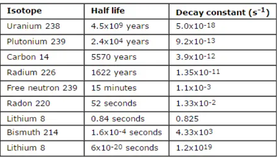
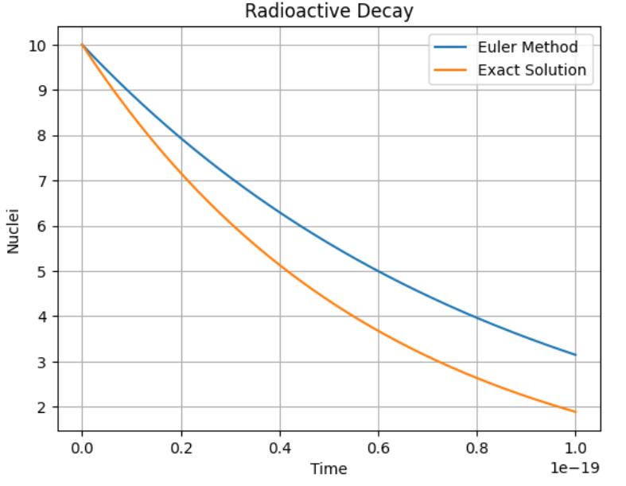
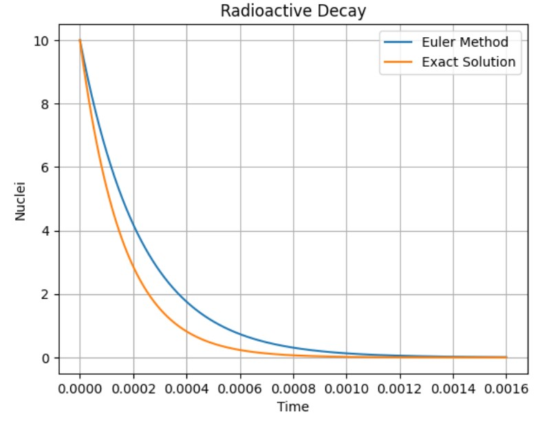
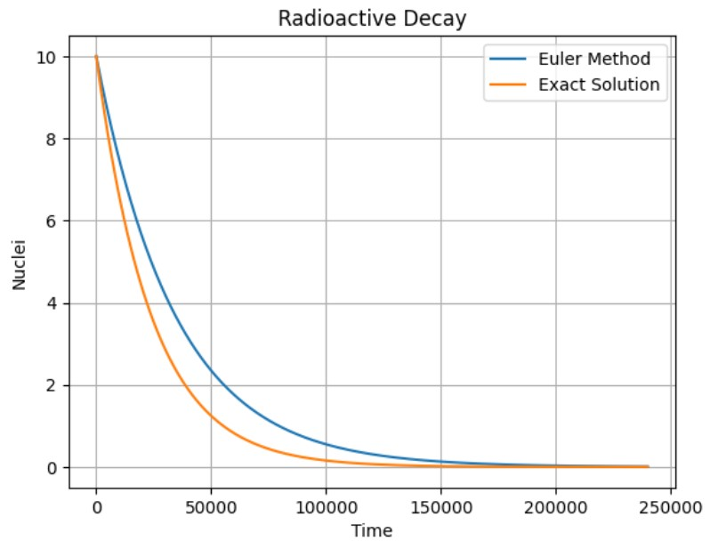

# **Radioactive Decay**


Radioactive decay is given by the following function:

```{math}
\frac {dN_{u}}{dt} = -\frac {N_{u}}{τ}
```

Where {math}`τ` is the time constant for the decay. To carry out the exact/analytical solution, what we will do is apply the method of **separable variables**, that is:

```{math}
\int \frac {dN_{u}}{N} = \int -\frac {dt}{τ}
```

```{math}
ln(N_{u}) = - \frac {1}{τ}t +C
```

```{math}
N(t) = e^{\frac {-t}{τ}+C} = e^{c} e^{\frac {-t}{τ}}
```

Which is the same as:

```{math}
N(t) = Ae^{\frac {-t}{τ}}
```
When {math}`t=0:`

```{math}
N(0) = N_{0} = A
```

So, we have at the end:

---

```{math}
N(t) = N_{0}e^{\frac {-t}{τ}}
```
---

Now, since we want to solve this numerically, we'll use Euler's method. This is because we have a first-order ordinary equation, so a more precise method is not necessary. Applying Euler, we are left with the equation that would govern the values of the nuclei in each step of time, would be:

```{math}
N(t + Δt) \approx N_{u}(t) - \frac {N_{u}(t)}{τ} Δt
```

In this first code, we will program both solutions: the exact one and the numerical one in order to compare them.

---

### **Exact solution**

Let´s remember that the equation that governs the analytical/exact solution of radioactive behavior is:

$$N(t)= A e^{-t/τ}$$

Where $τ$ represents the characteristic decay time. In order for us to see the exact solution in several times, we will use the same arrangement for the time that we will use for the numerical solution: we will plot the exact and numerical solutions on the same graph in order to better see the difference between them. The code is:

```
#Import Libraries-----
import math
import numpy as np
import matplotlib.pyplot as plt
```

```
def radioactiveDecay():
  #Intial Values--------
    N_ini = float(input("Enter the initial number of Nuclei: "))
    tm = float(input("Enter the decay constant (half-life) of your element: "))
    print("¡¡¡RECOMENDATION!!!")
    b = float(input("Enter the number that corresponds to the first instants of the decay of your element.\nA number of the type 1e-x in case the value of the constant is given by notation 10^{-x} so that the value of the x-1 corresponds to\nthe order of your constant.In case its value is integer, enter the value of the constant -1: "))
    t = np.linspace(0, b, 1000)
    N = [N_ini]
   #Not exact solution
    for i in range (len(t)-1):
      N.append( N[i] * (1 - (np.log(2)* t[1] / tm)) )

   #Exact Solution----------------------
    nu = N_ini*np.exp(-t/tm)

    #Graph---------
    plt.plot(t, N, label = "Nuclei")
    plt.plot(t, nu)
    plt.legend(["Euler Method", "Exact Solution"], loc="best")
    plt.grid("--")
    plt.title("Radioactive Decay")
    plt.xlabel("Time")
    plt.ylabel("Nuclei")
    plt.show()
```

Now, let's clarify a bit about the time scales that the code will use. As we know, the information about the decay constants is found in terms of half-life. This is the data that the user will enter: **the half-life** of the material

When we run our routine, the program will ask for three values:

* **`N_ini`** : Initial value of the nuclei that are

* **`tm`** : Value of the half-life of the element (constant), any that is in the table of constants that will be shown later can be used

* **`b`** : Value that will represent the first moments of time in which the material decays. This number, as a recommendation, should be greater than the constant by at least one unit. If it is in the form of {math}`\times 10^{-x}`, then it must be {math}`1e^{-x+1}`. For example:

   **Ra(226)** has a half-life of: {math}`1622`. So the value that we will enter will be {math}`\geq 1623`.

   **Ur(14)** has a half-life of: {math}`4.5 \times 10^{9}`. So the value we will enter will be {math}`\geq 4.5 \times 10^{10}`

This is because that is the information of the constant: how long does the element take for its nuclei to decay by half.

Now let's test our code with 3 different elements. For this we will leave a table of constants where any that is part of the **Half-Life** column can be used:



Let´s try our code!!!

```
#Radio (Ra) 226
radioactiveDecay()
```


```
#Bismuto (Bi) 214
radioactiveDecay()
```



```
#Plutonio (Pu) 239
radioactiveDecay()
```



