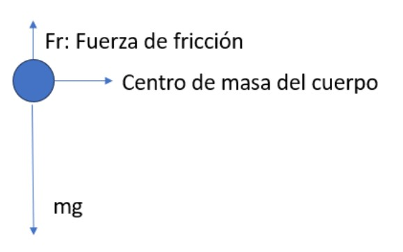
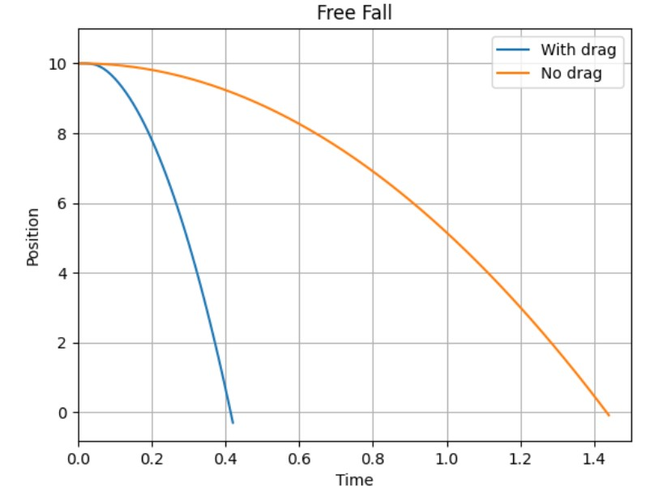
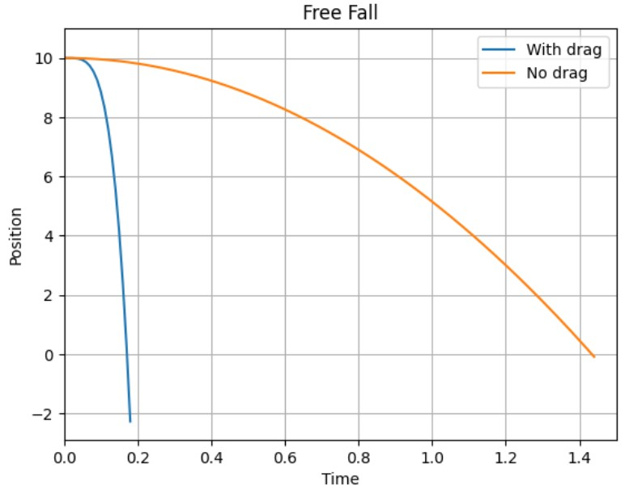

# **Free Fall with Friction**

In the movement of free fall, we have that the equation that describes it is:

```{math}
\sum F_{y} = mg -f_{r} = ma_{y}
```

**{math}`F_{r}`: Laminar fraction:** When the speed of fall is not so great, the value of {math}`f_{r}` is given by:

---

```{math}
f_{r} = bV_{y}
```

---
What is known as **Stokes' law**. Where {math}`b` is a friction constant that depends on the fluid where the motion is given. Let's see in the following image what our force diagram looks like and thus be able to define the equations of our system:




The differential equations that govern our free fall movement will then be those that concern the $y$ axis. In this case, what we can measure is the speed. Using Newton's second law we can say that:

```{math}
mg - bV_{y} = m \frac {dV_{y}}{dt}
```

We simplify and we have:

```{math}
\frac {dV_{y}}{dt} = g - \frac{b}{m}V_{y}
```

Where we will say that {math}`\frac {b}{m} = \gamma`

And where {math}`b` is the dynamic viscosity for a sphere, which is given by:

```{math}
6\pi R \mu V_{y}
```

The equations that we will approximate numerically then are:

---

```{math}
\frac {dv_{y}}{dt} = - g- \gamma v_{y}
```

```{math}
\frac {dy}{dt} = \frac {g}{\gamma}[1-e^{-\gamma Δt}] + v_{y}e^{-\gamma Δti}
```

----
The numerical method that we will use to approximate these differential equations will be the **Euler** method. With this method the equations of our movement are:

```{math}
v_{y{i+1}} = v_{y_{i}} - Δt (g+ \gamma v_{y_{i}})
```

```{math}
y_{i+1} = y_{i}+Δt [\frac {-g}{\gamma} (1-e^{-\gamma Δt}) + v_{y_{i}}e^{- \gamma Δt}]
```

-----

Now, for the values of the constant $\gamma$ let's remember that the coefficient of dynamic viscosity depends on the fluid, so we will add a table of constants where the value of any constant placed there can be entered in the code. It is important to keep in mind that if the coefficient is very low, the friction will not be much and will be very close to the ideal movement, so it is important to take into account the units of the constant and how big this number is.


Now, let´s code!:

```
#Import libaries-----
import numpy as np
import matplotlib.pyplot as plt
```

```
# Initial Values Friction
posy_friction  = 10 
vely_friction = 0 
time_step = 0.01 


# Initial Values Without Friction
posy_no_friction = 10 
vely_no_friction = 0 
```

As you may watched from the other codes, we´re making everything using functions, for this specific case, our function is:

```
def freeFall():
  dynamic_viscosity = float(input("Input the dynamic viscosity of the environment: "))
  posy = [posy_friction]; vely = [vely_friction] #Valores Iniciales
  posy2 = [posy_no_friction]; vely2 = [vely_no_friction]
  dt = time_step

  miu = dynamic_viscosity; m = 10; g = 9.8; R=5; #Constantes
  b = 6*np.pi*R*miu
  gamma = b/m

  i = 0
  time = [0]; time2 = [0]
  #Friccion-------------------------
  while posy[-1] > 0:
    vely.append(vely[i] - time[i] * (g+gamma*vely[i]))
    posy.append(posy[i] + time[i] * ((-g/gamma)*( 1-np.exp(-gamma*time[i]) ) + vely[i] * np.exp(-gamma*time[i]) ))
    time.append(time[i]+ dt)
    i +=1

  #No friccion-----------------------
  j = 0
  while posy2[-1] > 0:
    vely2.append(vely2[j] - dt * g)
    posy2.append(posy2[j] + dt * (vely2[0] - g * time2[j]))
    time2.append(time2[j]+ dt)
    j += 1

  plt.plot(time, posy, label="With drag")
  plt.plot(time2, posy2, label="No drag")
  plt.grid("--")
  plt.title("Free Fall")
  plt.xlabel("Time"); plt.ylabel("Position")
  plt.axis([0, 1.5, None, 11])
  plt.legend(loc="best")

```

Let´s try it!

```
#Glycerin; viscosity = 0.27
freeFall()

```


```
#Engine Oil; viscosity = 0.86
freeFall()
```


```
# Ethilic Alcohol; viscosity = 0.0012
freeFall()
```


